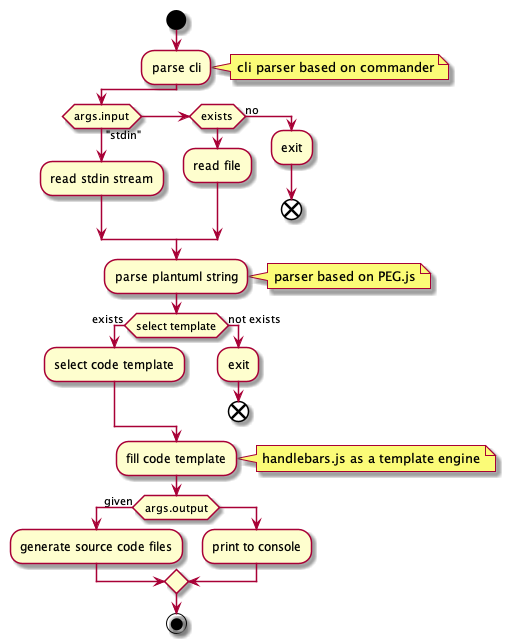

[](https://badge.fury.io/js/puml2code)
[](https://circleci.com/gh/jupe/puml2code/tree/master)
[](https://standardjs.com)
[](https://img.shields.io) 


## PlantUML code generator (puml2code)

a command line utility that convert Plantuml -text file that represent class UML diagram to source code.
puml parser based on [plantuml-code-generator](https://github.com/bafolts/plantuml-code-generator) but is rewritten with es6.

### Installation

Global installation brings `puml2code` command to PATH
```bash
$ npm i -g puml2code
```

Development installation
```bash
$ git clone https://github.com/jupe/puml2code.git
$ npm i
$ bin/puml2code -h
```

Running tests
```bash
$ npm test
```


### Supported output languages
* [CoffeeScript](test/data/car.coffeescript.coffee) (coffeescript)
* [C#](test/data/car.csharp.cs) (csharp)
* [C++](test/data/car.cpp.cpp) (cpp)
* [ECMAScript5](test/data/car.ecmascript5.js) (ecmascript5)
* [ECMAScript6](test/data/car.ecmascript6.js) (ecmascript6) [default]
* [Java](test/data/car.java.java) (java)
* [PHP](test/data/car.php.php) (php)
* [python](test/data/car.python.ts) (python)
* [Ruby](test/data/car.ruby.rb) (ruby)
* [TypeScript](test/data/car.typescript.ts) (typescript)


### Supported features
* output: file per class/console
* template engine: [handlebars](http://handlebarsjs.com)
* puml parser engine: [pegjs](http://pegjs.org)

Features supported per output language:

|Language|supported|docs|deps imports|
|--------|---------|---------|-------|
|Coffeescript|✓|||
|C#|✓|||
|C++|✓|✓||
|ECMAScript5|✓|||
|ECMAScript6|✓|✓|✓|
|Java|✓|||
|PHP|✓|||
|Python|✓|✓||
|Ruby|✓|||
|TypeScript|✓|||

Feature explanations:


|feature|notes|
|-------|----|
|supported|at least source code can be generated|
|docs|Documentation comments, eg python: docstring|
|deps imports|Try to detect dependencies and import them top of source files|


**NOTE:**

parser and code templates are not perfect. There is planty of cases that is not yet covered or supported. Basic scenarious should work.

### Problems?

* If `puml2code` causes error like:
    ```
    Error: line: 21 column: 3: SyntaxError: Expected "'", "--", "..", "__", "abstract ", 
    "class ", "hide empty members", "interface ", "namespace ", "note ", "skinparam", "title ",
    [ \t], [#], [+], [A-Za-z_], [\-], [\n], [\r\n], [^ ,\n\r\t(){}], or [}] but "{" found.
    ```
    it's most probably because [PEG.js based grammar](src/parser/plantuml.pegjs) does not have support 
    for plantuml format you have in input file. 
    
    **What should I do?**
    
    Please [raise ticket](https://github.com/jupe/puml2code/issues/new?template=grammar.md) with example plantuml file that does not work

* generated source code does not look like you expected
    
    **What should I do?**
    
    Please [raise ticket](https://github.com/jupe/puml2code/issues/new?template=output.md) with example plantuml file and generated source
    code with some description how it should look like.


**NOTE** If you are able to create PR that solves your issue it would be even more wellcome.

### Usage

```
$ puml2code -h
Usage: puml2code [options]

Options:
  -V, --version       output the version number
  -i, --input [file]  input .puml file, or "stdin"
  -l, --lang [lang]   Optional output source code language (default: "ecmascript6")
  -o, --out [path]    Output path. When not given output is printed to console.
  -h, --help          output usage information

Supported languages: coffeescript, csharp, ecmascript5, ecmascript6, java, php, python, ruby, typescript

Examples:
  $ puml2code -i input.puml -l ecmascript6
  $ puml2code -h
Use DEBUG=puml2code env variable to get traces. Example:
  $ DEBUG=puml2code puml2code -i input.puml
```

e.g.
```
$ puml2code -i myfile.puml

Scheduler.js:
// native modules
// 3rd party modules
// application modules
const Queue = require('./Queue');
const Resources = require('./Resources');


/**
 * Class Scheduler
 */
class Scheduler {
    /**
     * TBD
     */
    constructor(queue, resources) {
        this._queue = query;
        this._resoures = resources;
    }

    /**
     * @param {Queue} queue TBD
     */
    _test(queue) {
        // TBD
    }

    /**
     * @param {Queue} queue TBD
     */
    __protected(queue) {
        // TBD
    }
}
```
See more output examples [here](examples)

## Tool logic



### LICENSE:
[MIT](LICENSE)